<div align="right">
  <a href="README_TR.md">Türkçe</a> | <b>English</b>
</div>

<div align="center">
  
  <br/><br/>
  <h1>E-OS — ESP32-S3 Handheld Console</h1>
  <p>An ESP32-S3 based, dual-screen (TFT+OLED) handmade gaming console project running on a FreeRTOS architecture.</p>
  
  <p>
    
    
    
    
  </p>
  
  <h3>
    <a href="https://emir173.github.io/esp32-console/">🌐 Project Website</a>
  </h3>
</div>

---

## About the Project
This project is a handheld console developed from scratch using the ESP32-S3 microcontroller. Without relying on any pre-built UI frameworks or emulators, the operating system (E-OS) and the game engines were custom coded in C++ to run specifically on this hardware.

### Hardware Architecture
- **Processor:** Dual-Core ESP32-S3 running at 240 MHz.
- **Dual Display:** 
  - *Main Screen:* 320x240 HS280S010B/ST7789V Color TFT (SPI). Handles the main game rendering and UI.
  - *Secondary Screen:* 128x64 OLED (I2C). Located at the top of the device; displays system status and high scores.
- **Memory:** 16MB Flash + 8MB PSRAM OPI. Massive memory bandwidth ensures a stutter-free experience.
- **Audio & Controls:** 8-bit buzzer and an analog joystick (with hardware deadzone filtering).
- **Storage:** Micro SD Card integration for game assets.

---

## Software Architecture (E-OS)
- **FreeRTOS:** One processor core (Core 0) handles the game logic, while the other core (Core 1) is entirely dedicated to screen rendering.
- **Carousel UI:** Features an animated, rotating carousel menu design for navigating between games.
- **Hardware Pause:** Thanks to RTOS task management, games can be paused instantly at the hardware level.

---

## 15 Custom Games
All games are heavily optimized for the device's resolution and hardware limits.

<table>
  <tr>
    <td width="200" align="center">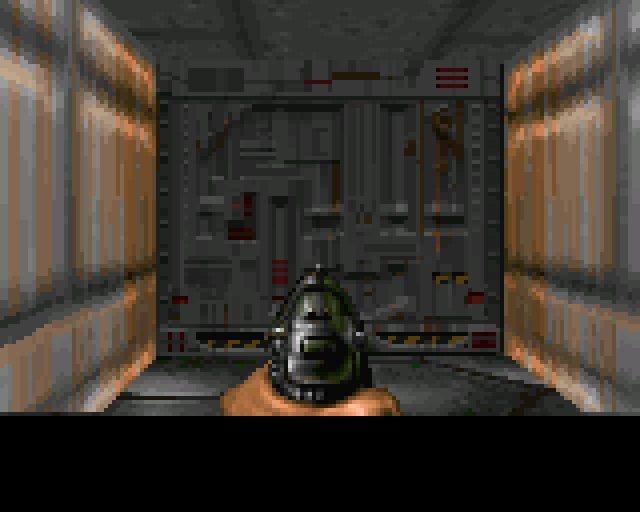</td>
    <td valign="middle"><b>DOOM:</b> Doom-style raycasting engine.</td>
  </tr>
  <tr>
    <td width="200" align="center">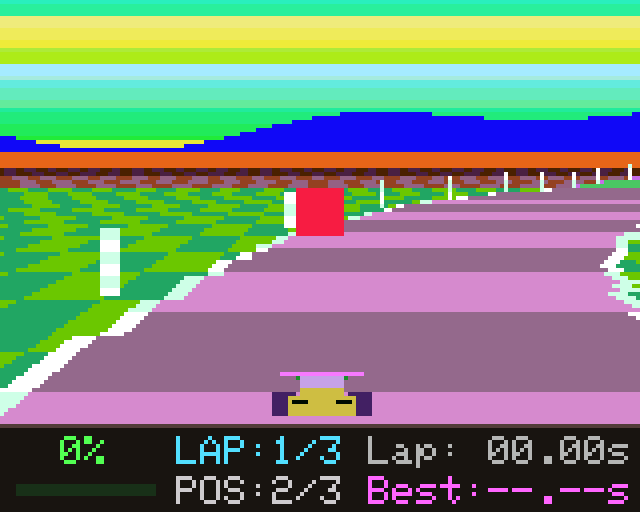</td>
    <td valign="middle"><b>MODE 7 RACING:</b> Classic racing mechanics. Collect checkpoints and leave rivals behind.</td>
  </tr>
  <tr>
    <td width="200" align="center">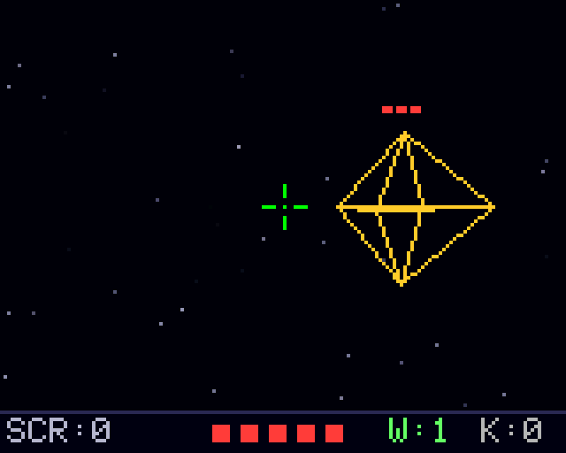</td>
    <td valign="middle"><b>WIRE-FRAME 3D:</b> 3D space battles against alien forces.</td>
  </tr>
  <tr>
    <td width="200" align="center">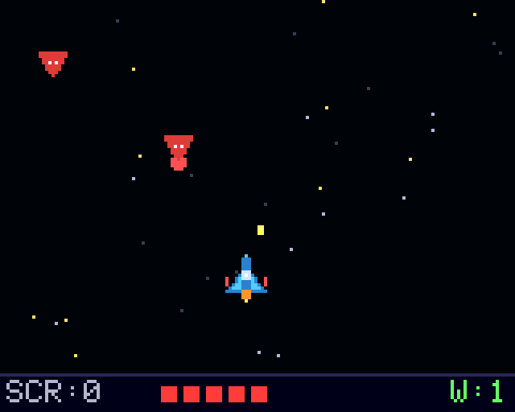</td>
    <td valign="middle"><b>GALACTIC STRIKE:</b> Survive enemy fleets, collect power-ups and defeat bosses.</td>
  </tr>
  <tr>
    <td width="200" align="center">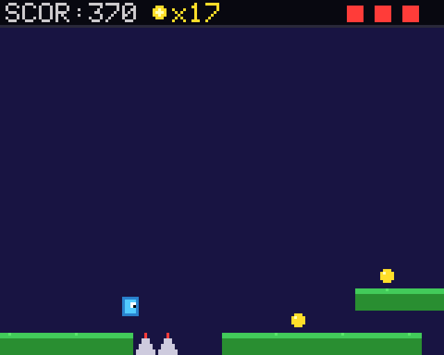</td>
    <td valign="middle"><b>PLATFORMER:</b> Overcome obstacles, dodge traps, and beat the levels.</td>
  </tr>
  <tr>
    <td width="200" align="center">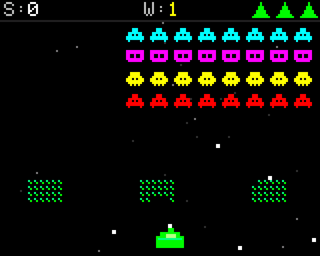</td>
    <td valign="middle"><b>SPACE INVADERS:</b> Survive waves of incoming aliens.</td>
  </tr>
  <tr>
    <td width="200" align="center">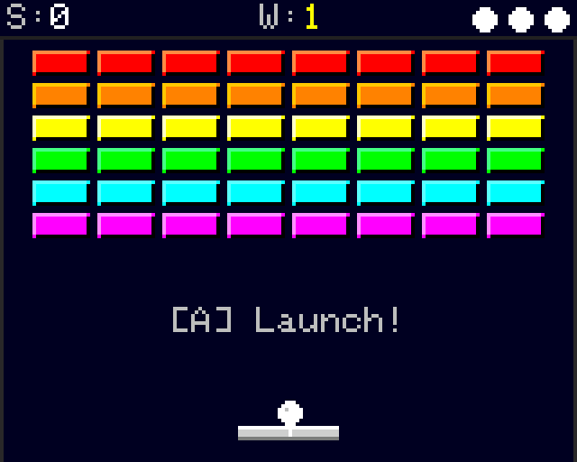</td>
    <td valign="middle"><b>ARKANOID:</b> Break all bricks with an accelerating ball.</td>
  </tr>
  <tr>
    <td width="200" align="center">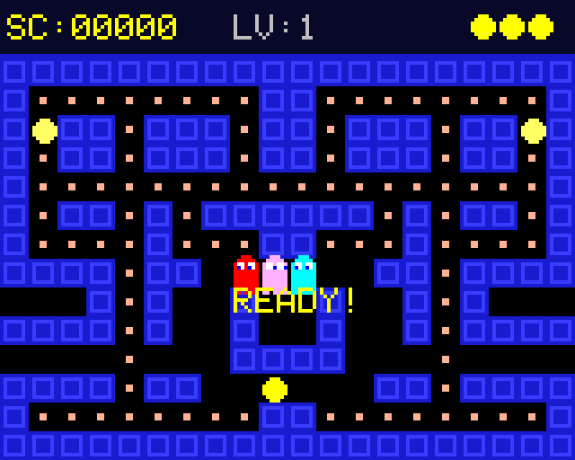</td>
    <td valign="middle"><b>PAC-MAN:</b> Escape ghosts and collect all dots in the maze.</td>
  </tr>
  <tr>
    <td width="200" align="center">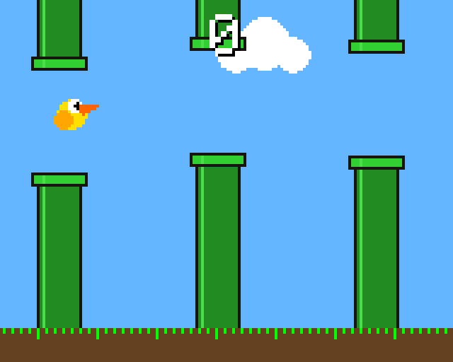</td>
    <td valign="middle"><b>FLAPPY BIRD:</b> Fly carefully through the pipe obstacles.</td>
  </tr>
  <tr>
    <td width="200" align="center">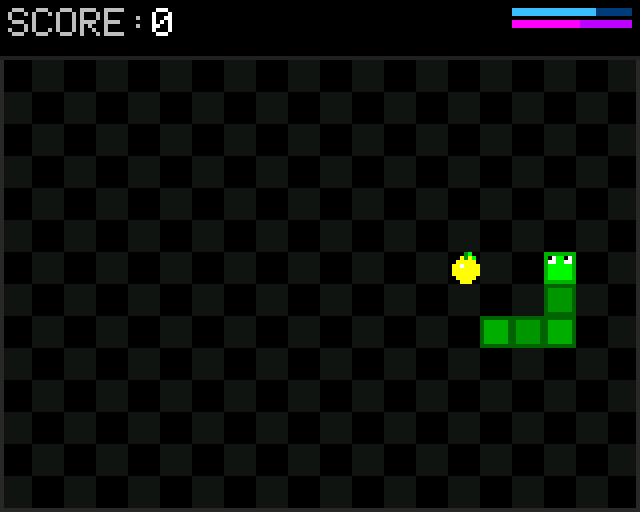</td>
    <td valign="middle"><b>SNAKE:</b> Grow your tail, don't hit the walls or yourself.</td>
  </tr>
  <tr>
    <td width="200" align="center">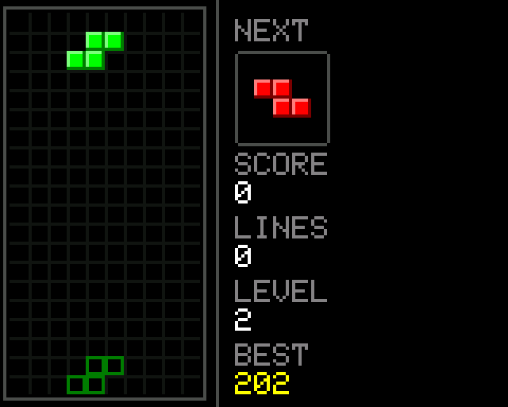</td>
    <td valign="middle"><b>TETRIS:</b> Stack the blocks, clear the lines; speed up as the level rises.</td>
  </tr>
  <tr>
    <td width="200" align="center">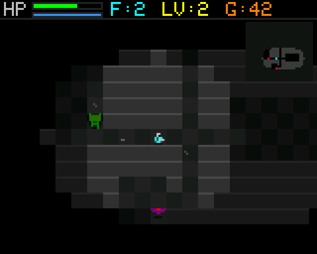</td>
    <td valign="middle"><b>DUNGEON:</b> Top-down dungeon crawler with boss fights, a spell system, a merchant and varied biomes.</td>
  </tr>
  <tr>
    <td width="200" align="center">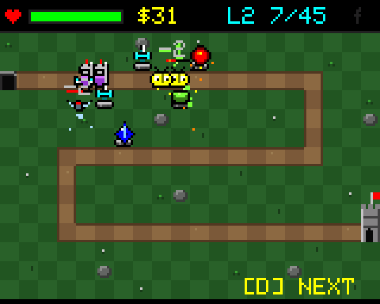</td>
    <td valign="middle"><b>TOWER DEFENSE:</b> Wave-based strategy: place towers, upgrade them and call in the waves you manage.</td>
  </tr>
  <tr>
    <td width="200" align="center">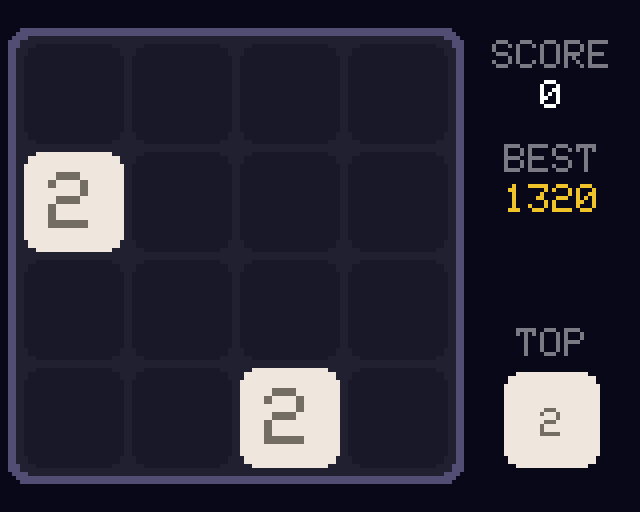</td>
    <td valign="middle"><b>2048:</b> Combine matching numbers to reach the 2048 tile.</td>
  </tr>
  <tr>
    <td width="200" align="center">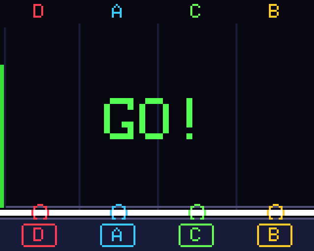</td>
    <td valign="middle"><b>RHYTHM:</b> Keep up with the music beat and catch the falling neon notes.</td>
  </tr>
</table>


## 3 Apps

<table>
  <tr>
    <td width="200" align="center">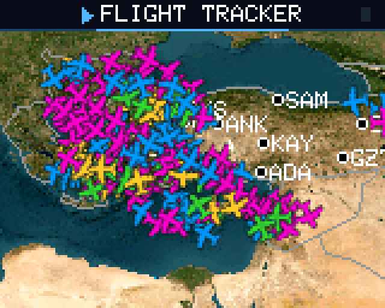</td>
    <td valign="middle"><b>FLIGHT TRACKER:</b> Near real-time flight tracking system. Track planes using the OpenSky Network API.</td>
  </tr>
  <tr>
    <td width="200" align="center">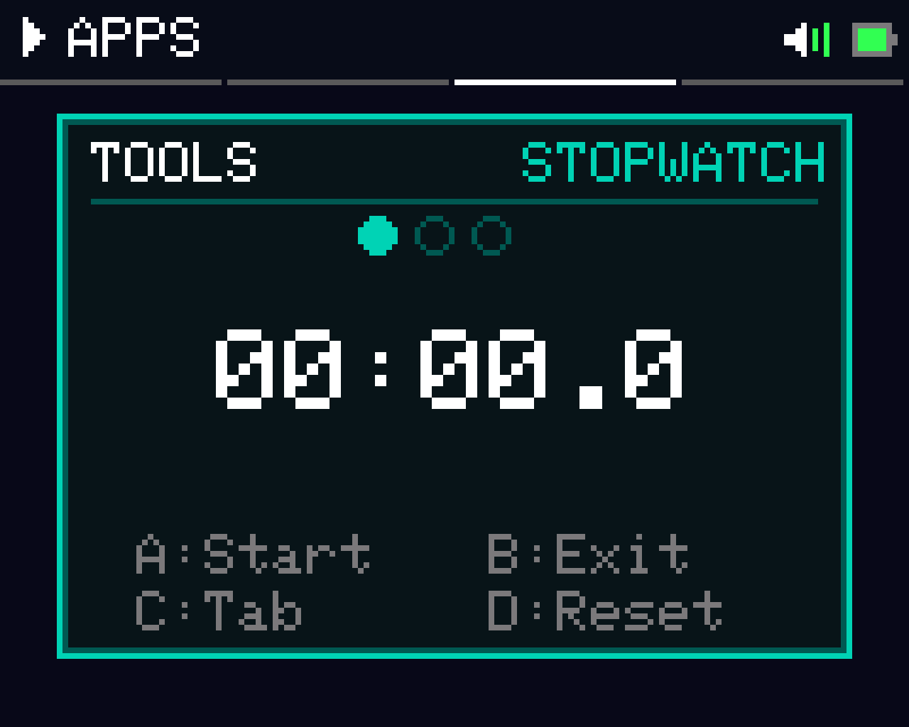</td>
    <td valign="middle"><b>TOOLS:</b> A basic hardware tool containing a stopwatch and a metronome.</td>
  </tr>
  <tr>
    <td width="200" align="center">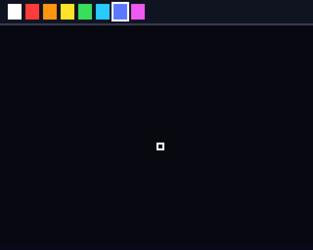</td>
    <td valign="middle"><b>DRAW (ETCH-A-SKETCH):</b> Classic Etch-a-Sketch style drawing app. Change modes and draw in color.</td>
  </tr>
</table>

## Operating System (E-OS Launcher)
The **E-OS Launcher** acts as the main OS, providing a fluid, rotating (carousel) main menu interface hosting all games.

- **Hardware Pause:** Instantly suspend the active RTOS task by pressing the joystick button in any game.
- **Double-Buffered UI:** Rotating carousel menu runs completely tear-free, offering smartphone-like smooth transitions.
- **OTA Bootloader:** Reads binaries from SD card and writes to flash. Reboot state is remembered via RTC magic values.
- **Hardware Sound Control:** Mute, lower (LOW), or play games at full volume (HIGH) globally via the Settings menu.
- **Live FPS Overlay:** Real-time frame rate (FPS) overlay available for developers on all games.
- **Asynchronous Dual-Core:** Core 0 strictly handles background tasks and game logic, while Core 1 is dedicated to drawing graphics.

---

## Screenshot System (Over USB)
Screenshots and GIFs are captured **over the USB serial connection**. The asynchronous `FrameDumper` streams the framebuffer to the PC while the game keeps running at 60 FPS. 
To process and save this data as PNGs or GIFs on your computer, the Python tools (`capture.py`, `capture_gif.py`, etc.) located in the `tools/` directory are used.

---

## How to Compile

### Required Libraries
- `TFT_eSPI` — TFT display driver (ST7789V)
- `U8g2` — OLED display driver (SH1106)
- `SD` — SD card access
- `Preferences` — NVS high-score saving

### Setup Steps
1. **TFT_eSPI Setup:** Copy the `User_Setup.h` file into your TFT_eSPI library folder:
   ```
   Windows: C:\Users\<user>\Documents\Arduino\libraries\TFT_eSPI\User_Setup.h
   ```
2. **Partitions:** Use the `partitions.csv` file provided in each game folder.
3. **Board Settings (Arduino IDE):**
   - Board: **ESP32S3 Dev Module**
   - Flash Size: **16MB (128Mb)**
   - PSRAM: **OPI 8MB**
   - Partition Scheme: **Custom** (partitions.csv)
4. **Compilation:** Each game is compiled as a separate `.ino` file in its own folder. `launcher.ino` is the main OS.

### Pin Configuration

| Pin | Function |
|-----|----------|
| 12 | SPI SCK |
| 11 | SPI MOSI |
| 14 | SPI MISO |
| 15 | TFT CS |
| 10 | SD CS |
| 13 | TFT DC |
| 7 | TFT RESET |
| 16 | Backlight switch enable |
| 41 | I2C SDA (OLED) |
| 42 | I2C SCL (OLED) |
| 1 | Joystick X |
| 2 | Joystick Y |
| 18 | Joystick SW |
| 3 | Button A |
| 21 | Button B |
| 6 | Button C |
| 4 | Button D |
| 5 | Buzzer |

---
<div align="center">
  <i>E-OS Console Project</i>
</div>
