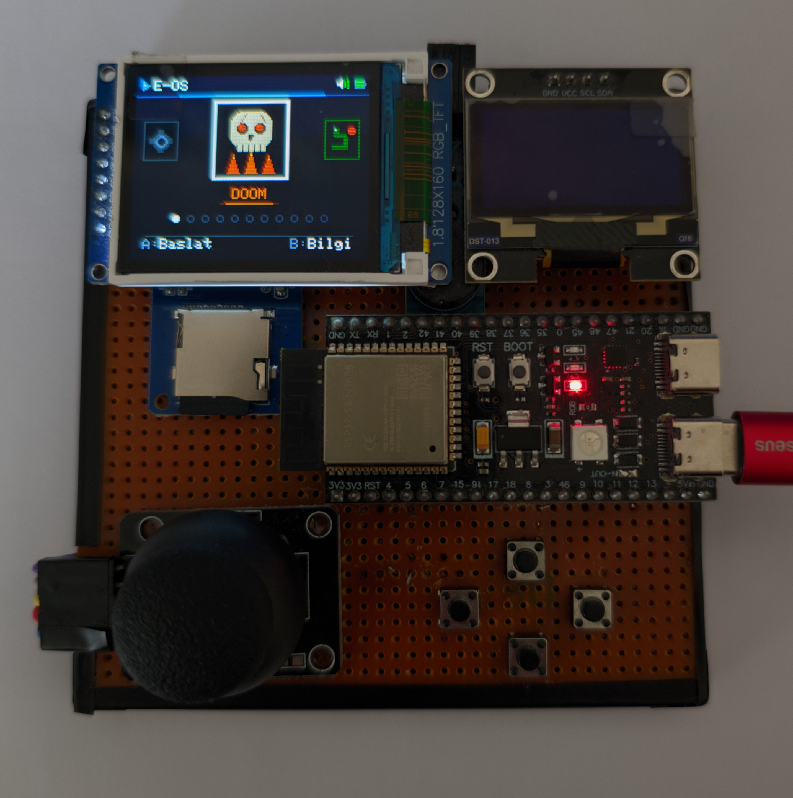
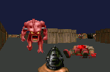
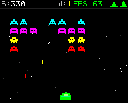
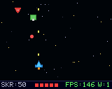
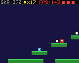
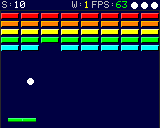
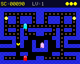
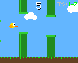
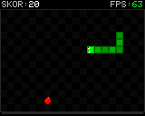

<div align="right">
  <b>🇹🇷 Türkçe</b> | <a href="README_EN.md">🇬🇧 English</a>
</div>

<div align="center">
  
  <br/><br/>
  <h1>E-OS — ESP32-S3 El Konsolu</h1>
  <p>ESP32-S3 tabanlı, çift ekranlı (TFT+OLED) ve FreeRTOS mimarisi üzerinde çalışan el yapımı oyun konsolu projesi.</p>
  
  <p>
    
    
    
    
  </p>
  
  <h3>
    <a href="https://emir173.github.io/esp32-console/">🌐 Proje Web Sitesi</a>
  </h3>
</div>

---

## 🚀 Proje Hakkında
Bu proje, ESP32-S3 mikrodenetleyicisi kullanılarak sıfırdan geliştirilmiş bir el konsoludur. Herhangi bir hazır arayüz veya emülatör kullanılmadan, işletim sistemi (E-OS) ve oyun motorları donanıma özel olarak C++ ile kodlanmıştır.

### ⚙️ Donanım Mimarisi
- **İşlemci:** 240 MHz hızında çalışan Dual-Core ESP32-S3.
- **Çift Ekran:** 
  - *Ana Ekran:* 160x128 Renkli TFT (SPI). Ana oyun akışı ve UI.
  - *İkinci Ekran:* 128x64 OLED (I2C). Cihazın üst kısmında durum bilgileri ve skorlar için kullanılır.
- **Bellek:** 16MB Flash + 8MB PSRAM OPI. Geniş bellek kapasitesi sayesinde akıcı bir deneyim sunar.
- **Ses ve Kontrol:** 8-bit buzzer ve analog joystick (deadzone filtreli).
- **Depolama:** Oyun verileri için Micro SD Kart entegrasyonu.

---

## 🧠 Yazılım Mimarisi (E-OS)
- **FreeRTOS:** İşlemcinin bir çekirdeği (Core 0) oyun mantığını işlerken, diğer çekirdeği (Core 1) ekran çizimi (rendering) işlemlerini yürütür.
- **Carousel UI:** Oyunlar arası geçişler için dönerek açılan, animasyonlu bir arayüz tasarımı mevcuttur.
- **Donanımsal Duraklatma (Pause):** RTOS görev yönetimi sayesinde oyunlar donanımsal olarak anında duraklatılabilir.

---

## 🕹️ 11 Adet Özel Oyun
Tüm oyunlar cihazın çözünürlüğüne ve donanım limitlerine göre optimize edilmiştir.

<table>
  <tr>
    <td width="200" align="center"></td>
    <td valign="middle"><b>DOOM (3D Raycasting):</b> 3D ortamlar ve düşman yapay zekası (FreeRTOS triple-buffer + PSRAM dokuları).</td>
  </tr>
  <tr>
    <td width="200" align="center"></td>
    <td valign="middle"><b>Wire3D:</b> Wireframe grafikli uzay savaşı.</td>
  </tr>
  <tr>
    <td width="200" align="center"></td>
    <td valign="middle"><b>Space Invaders:</b> Klasik uzaylı vurma mekanikleri ve OLED entegrasyonu.</td>
  </tr>
  <tr>
    <td width="200" align="center"></td>
    <td valign="middle"><b>Galactic Strike:</b> Uzay gemisi temalı savaş oyunu.</td>
  </tr>
  <tr>
    <td width="200" align="center"></td>
    <td valign="middle"><b>Mode7:</b> SNES tarzı pseudo-3D yarış motoru.</td>
  </tr>
  <tr>
    <td width="200" align="center"></td>
    <td valign="middle"><b>Platformer:</b> Yan kaydırmalı (side-scrolling) platform oyunu.</td>
  </tr>
  <tr>
    <td width="200" align="center"></td>
    <td valign="middle"><b>Arkanoid:</b> Joystick kontrollü tuğla kırma oyunu.</td>
  </tr>
  <tr>
    <td width="200" align="center"></td>
    <td valign="middle"><b>Pac-Man:</b> Özel yapay zekaya sahip hayaletler ve klasik labirent.</td>
  </tr>
  <tr>
    <td width="200" align="center"></td>
    <td valign="middle"><b>Flappy Bird:</b> Zamanlama odaklı beceri oyunu.</td>
  </tr>
  <tr>
    <td width="200" align="center"></td>
    <td valign="middle"><b>Snake:</b> Klasik yılan oyunu.</td>
  </tr>
</table>

*Not: Sistem ayrıca konsolun tamamını yöneten dönen menülü animasyonlu **E-OS Launcher** işletim sistemini içermektedir.*

---

## 📸 Screenshot Sistemi (Geçici Olarak Kapalı)
Oyunlarda ekran görüntüsü alma özelliği (SD Karta BMP yazdırma), **SPI veriyolu çakışması (TFT ve SD kart arası donma)** nedeniyle `dev_tools.h` üzerinden kalıcı olarak devre dışı bırakılmıştır. İlgili kayıt fonksiyonları kodlarda mevcuttur; ilgilenen geliştiriciler asenkron bir çözüm üzerinde çalışabilir.

---

## ✨ Öne Çıkan Özellikler
- **Güvenlik & Bellek:** Kod genelindeki bellek zafiyetleri temizlendi, stack limitleri artırıldı.
- **OTA Koruması:** Bozuk dosya güncellemelerini engelleyen Magic Byte koruması eklendi.
- **Standartlaşma:** Donanım pinleri merkezileştirildi. Ortak API kullanımı için `GameBase.h` sarmalayıcısı oluşturuldu.

---

## 🤝 Katkıda Bulunmak İsteyenler İçin (Good First Issues)
Projeyi geliştirmek isteyenler için açık görevler:
1. **[Refactor] Launcher `delay()` Temizliği:** Ana menüdeki buton okumalarında kullanılan `delay()` döngülerinin asenkron `millis()` tabanlı yapıya geçirilmesi.
2. **[Refactor] `GameBase.h` Entegrasyonu:** Kalan eski oyunların ortak `GameBase.h` mimarisine geçirilmesi.
3. **[Refactor] Sihirli Sayılar (Magic Numbers):** Eski oyunlardaki ham HEX renk kodlarının (örn. `0xF800`) okunabilir makrolara dönüştürülmesi.

---

## 💻 Nasıl Derlenir?

### Gerekli Kütüphaneler
- `TFT_eSPI` — TFT ekran sürücüsü (ST7735)
- `U8g2` — OLED ekran sürücüsü (SH1106)
- `SD` — SD kart erişimi
- `Preferences` — NVS yüksek skor kaydı

### Kurulum Adımları
1. **TFT_eSPI kurulumu:** `User_Setup.h` dosyasını TFT_eSPI kütüphane klasörüne kopyalayın:
   ```
   Windows: C:\Users\<kullanıcı>\Documents\Arduino\libraries\TFT_eSPI\User_Setup.h
   ```
2. **Partitions:** Her oyun klasöründe bulunan `partitions.csv` dosyasını kullanın.
3. **Board ayarları (Arduino IDE):**
   - Board: **ESP32S3 Dev Module**
   - Flash Size: **16MB (128Mb)**
   - PSRAM: **OPI 8MB**
   - Partition Scheme: **Custom** (partitions.csv)
4. **Derleme:** Her oyun kendi klasöründe ayrı bir `.ino` dosyası olarak derlenir. `launcher.ino` ana OS'tir.

### Pin Bağlantıları

| Pin | İşlev |
|-----|-------|
| 12 | SPI SCK |
| 11 | SPI MOSI |
| 42 | SPI MISO |
| 15 | TFT CS |
| 10 | SD CS |
| 41 | TFT DC |
| 8 | I2C SDA (OLED) |
| 9 | I2C SCL (OLED) |
| 1 | Joystick X |
| 2 | Joystick Y |
| 18 | Joystick SW |
| 3 | Buton A |
| 21 | Buton B |
| 4 | Buton C |
| 6 | Buton D |
| 5 | Buzzer |

---
<div align="center">
  <i>E-OS Konsol Projesi</i>
</div>
