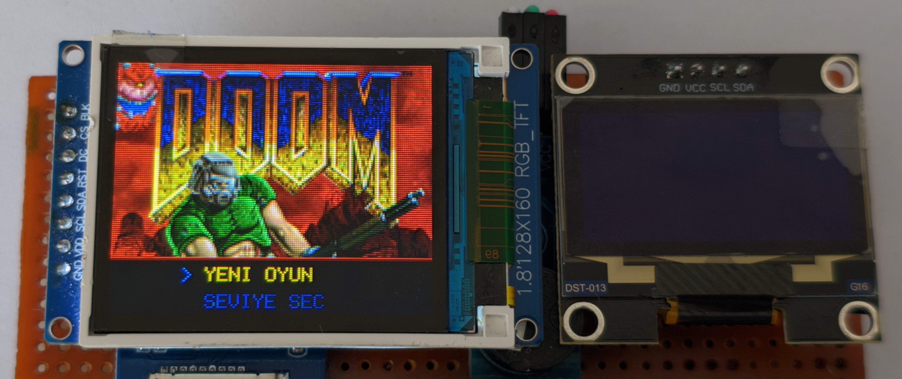
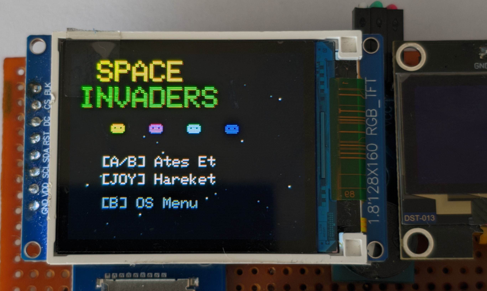
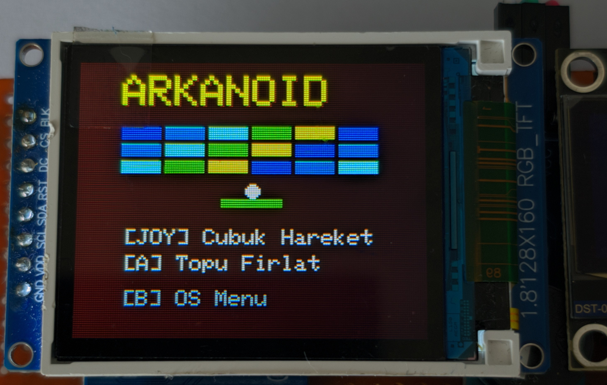
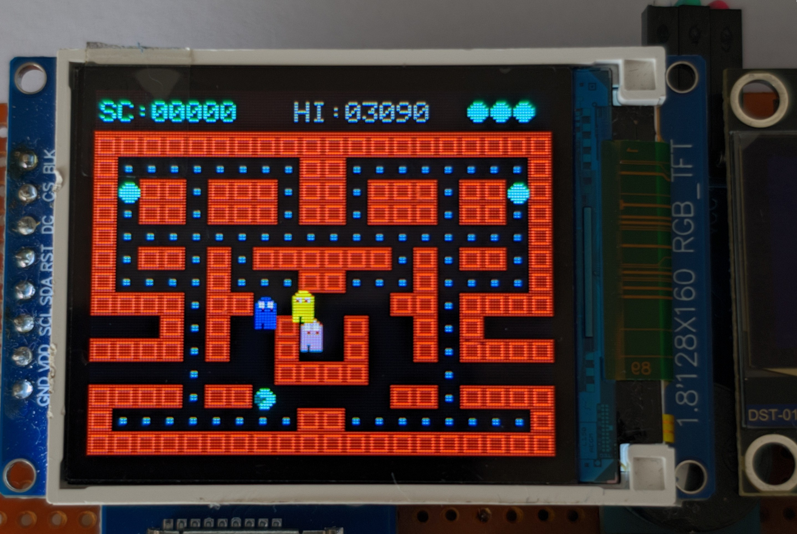
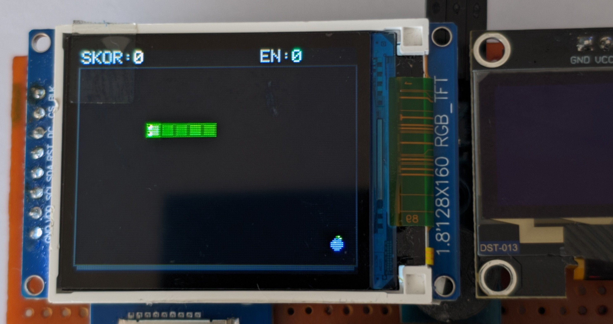

  
    
  <h1>E-OS V2.1 — Handheld Console</h1>
  
<b>Sınırları Zorlayan Güç.</b>

  
ESP32-S3 mimarisi üzerinde sıfırdan yazılmış E-OS işletim sistemi. Çift ekran, 6 tam ekran oyun ve muazzam bir akıcılık.

  
  

    
    
    
    
  

---

## 🚀 Proje Hakkında
Sıradan bir "DIY" projesine bakmıyorsunuz. **E-OS V2.1**, mikrodenetleyici limitlerinin sonuna kadar zorlandığı, işletim sisteminden (OS) oyun motorlarına kadar her şeyin **sıfırdan** yazıldığı ve donanımla tam entegre edildiği bir mühendislik eseridir. İçinde hiçbir hazır arayüz veya emülatör bulunmaz. Her bir piksel, cihaza özel kodlanmıştır.

### ⚙️ Donanım Mimarisi
Cihazın kalbinde 240 MHz hızında çalışan **Dual-Core ESP32-S3** bulunuyor. 
- **Çift Ekran (Dual Display):** 
  - *Ana Ekran:* 160x128 Renkli TFT (SPI). Tüm aksiyon ve ana UI burada akar.
  - *İkinci Ekran:* 128x64 OLED (I2C). Cihazın tepesinde bulunur; flash bellek bilgisini, logoları, oyunlardaki en yüksek skoru ve taktiksel istatistikleri anlık olarak yansıtır.
- **Bellek:** 16MB Flash + 8MB PSRAM OPI. Bu devasa bant genişliği sayesinde oyunlar arası geçişlerde "Frame Drop" (takılma) veya ekran yırtılması (screen-tear) yaşanmaz.
- **Ses ve Kontrol:** Yazılımsal frekans filtreli **8-bit akustik buzzer** ve donanımsal deadzone (titreme önleyici) korumalı Analog Joystick.
- **Depolama:** Oyun verileri için Micro SD Kart entegrasyonu.

---

## 🧠 Yazılım ve E-OS İşletim Sistemi
Hazır kütüphanelerin aksine E-OS, doğrudan donanımla konuşur.
* **FreeRTOS Entegrasyonu:** İşlemcinin birinci çekirdeği (Core 0) oyun mantığını ve raycasting matematiğini hesaplarken, ikinci çekirdeği (Core 1) tamamen ekranların pürüzsüz çizimine (rendering) adanmıştır.
* **Double-Buffered UI:** Cihazın ana menüsü tam bir akıllı telefon hissiyatı verir. Dönerek açılan animasyonlu carousel menü tasarımı sayesinde oyunlar arasında hızlıca dolaşabilirsiniz.
* **Donanımsal Duraklatma (Pause):** Hangi oyunda olursanız olun, donanımsal "Pause" butonuna bastığınızda RTOS görevleri (task) dondurulur ve oyun anında duraklatılır.

---

## 🕹️ Özel Kodlanmış 6 Efsane Oyun
Oyunlar basit birer port değildir; bu cihazın çözünürlüğü ve işlemcisi için yeniden inşa edilmiştir.

  
  

1. **DOOM (3D Raycasting):** Mikrodenetleyicilerde görmesi nadir olan, gerçek zamanlı 3D ortamlar, silah mekanikleri ve düşman yapay zekası **100+ FPS** hızında TFT ekrana akar.
2. **Space Invaders:** Dalga dalga gelen uzaylılara karşı pürüzsüz mekanikler ve OLED ekran entegrasyonu.
3. **Arkanoid (Breakout):** Joystick hassasiyetinin ön planda olduğu, seviyeleri giderek zorlaşan tuğla kırma efsanesi.
4. **Pac-Man:** Özel yapay zeka ile kodlanmış hayaletler ve klasik labirent heyecanı.
5. **Flappy Bird:** Milisaniyelik tepkiler isteyen bağımlılık yapıcı donanım testi.
6. **Snake:** Akıcı mekanikleriyle retro yılan oyunu.

  
  
  

---

## 📸 Proje Sunumu
Tasarımın, oyunların ve donanım arayüzünün (ayarlar, oyun sonu animasyonları vb.) tamamını detaylı bir dijital katalog şeklinde incelemek isterseniz, repo içindeki `docs/index.html` dosyasını tarayıcınızda açabilirsiniz!

### 💻 Nasıl Derlenir?
Bu proje **Arduino IDE / PlatformIO** kullanılarak derlenebilir. Gerekli kütüphaneler:
- `TFT_eSPI` (Ekran Sürücüsü)
- `Adafruit_GFX` ve `Adafruit_SH110X` (OLED Sürücüsü)
*(Pin ayarları `User_Setup.h` dosyası içerisinde tanımlıdır).*

---

  <i>E-OS V2.1 Konsol Projesi | Sıfırdan Kodlandı</i>

